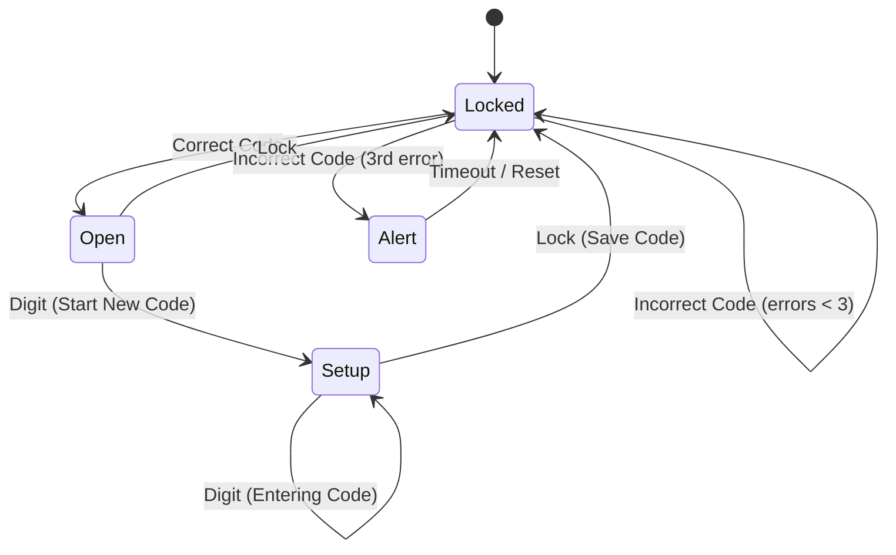

# Вариант Р16

### Задание 1 (10 баллов)
Халла-балла.
Встречаются два аборигена.
Первый сказал: «...» (но мы не услышали, «Халла-балла»).
Второй сказал: «Он ответил Да, но он лжец».
Единственный вопрос, на который рыцарь и лжец отвечают одинаково ("Да") — это "Вы рыцарь?".
(Рыцарь скажет правду "Да", Лжец соврёт "Да").

**Анализ:**
Пусть заявление Второго: $S_2 = (\text{Первый ответил "Да"}) \land (\text{Первый — лжец})$.
Факт: Первый всегда отвечает "Да" на вопрос "Вы рыцарь?". Значит, первая часть конъюнкции истинна.

1. **Вариант: Второй — Рыцарь.**
   Тогда $S_2$ истинно.
   Следовательно, $(\text{Первый — лжец})$ истинно.
   **Итог:** Второй — Рыцарь, Первый — Лжец.

2. **Вариант: Второй — Лжец.**
   Тогда $S_2$ ложно.
   Так как $(\text{Первый ответил "Да"})$ — истина, то для ложности всей конъюнкции вторая часть $(\text{Первый — лжец})$ должна быть ложной.
   Если $(\text{Первый — лжец})$ ложно, то Первый — Рыцарь.
   **Итог:** Второй — Лжец, Первый — Рыцарь.

**Вывод:**
Формально существуют два решения. Однако в классических задачах (например, Смаллиана) при такой постановке подразумевается первый вариант (Второй изобличает Первого).
Часто в условии есть контекст, исключающий второй случай (например, реакция Первого).
**Ответ:** Второй — Рыцарь, Первый — Лжец.

---

### Задание 2 (10 баллов)
Животные.
Формализуйте утверждение: "Высокий тогда и только тогда, когда жираф".

**Решение:**
Предикаты:
- $T(x)$: $x$ высокий (Tall)
- $G(x)$: $x$ жираф (Giraffe)

Формула:
$$ \forall x (T(x) \leftrightarrow G(x)) $$

---

### Задание 3 (20 баллов)
Сейф автомат.
4 состояния: Open, Setup, Locked, Alert.
Переходы по цифрам (0-9) и кнопке Lock.

**Формализация автомата:**

*   $Q = \{\text{Open}, \text{Setup}, \text{Locked}, \text{Alert}\}$
*   $\Sigma = \{0..9, \text{Lock}\}$
*   $q_0 = \text{Locked}$

**Логика переходов:**
1.  **Open**: Сейф открыт.
    *   Ввод цифр $\to$ переход в **Setup** (начало смены кода).
    *   Нажатие Lock $\to$ переход в **Locked** (закрыть с текущим кодом).
2.  **Setup**: Режим смены кода.
    *   Ввод цифр $\to$ остаемся в **Setup** (накопление буфера кода).
    *   Нажатие Lock $\to$ сохранение кода и переход в **Locked**.
3.  **Locked**: Сейф закрыт.
    *   Нажатие Lock $\to$ игнор или остаемся в Locked.
    *   Ввод цифр $\to$ проверка кода.
        *   Если код верный (последовательность завершена) $\to$ **Open**.
        *   Если код неверный $\to$ **Locked** (увеличение счетчика ошибок).
        *   Если счетчик ошибок $\ge 3$ $\to$ **Alert**.
4.  **Alert**: Тревога.
    *   Блокировка ввода на время или до спец. сброса (reset). Переход в **Locked** после тайм-аута.

**Диаграмма переходов:**

---

### Задание 4 (5 баллов)
Сдвиг координат (кардиоида).
Преобразование: $x' = x+1, y' = y-2$.

**Решение:**
Чтобы найти уравнение кривой в новых координатах $(x', y')$, выражаем старые координаты через новые:
$x = x' - 1$
$y = y' + 2$
Подставляем это в исходное уравнение кривой.

Пример для кардиоиды $(x^2 + y^2 - ax)^2 = a^2(x^2 + y^2)$:
$$ ((x'-1)^2 + (y'+2)^2 - a(x'-1))^2 = a^2((x'-1)^2 + (y'+2)^2) $$
Это и есть искомое уравнение (можно раскрыть скобки, но обычно достаточно формы подстановки).

---

### Задание 5 (15 баллов)
Следствия в логике LTL.
Доказать или опровергнуть: $p \,\mathcal{U}\, \mathcal{G} p \implies \mathcal{F} \mathcal{G} p$.

**Решение:**
Утверждение **верно**.

**Доказательство:**
Определение оператора Until ($p \,\mathcal{U}\, \psi$):
$\pi \models p \,\mathcal{U}\, \psi \iff \exists i \ge 0: (\pi^i \models \psi) \land (\forall 0 \le j < i: \pi^j \models p)$.

В нашем случае $\psi = \mathcal{G} p$.
Пусть путь $\pi$ удовлетворяет левой части.
Тогда $\exists i \ge 0$, такой что $\pi^i \models \mathcal{G} p$.

Определение оператора Future ($\mathcal{F} \phi$):
$\pi \models \mathcal{F} \phi \iff \exists k \ge 0: \pi^k \models \phi$.

Возьмем $k = i$ и $\phi = \mathcal{G} p$.
Так как мы уже нашли такое $i$, что $\pi^i \models \mathcal{G} p$, то условие для $\mathcal{F} \mathcal{G} p$ выполнено.

**Ответ:** Импликация справедлива.

Семантика U: φ U ψ истинно, если существует момент j, когда ψ истинно, и для всех i < j истинно φ.

Для p U G p:
- Существует момент j, когда G p становится истинным
- До момента j выполняется p

После момента j: G p означает, что p истинно всегда начиная с j.

**Анализ F G p:**

F G p означает: когда-нибудь p станет истинным навсегда.

**Импликация:**

Если p U G p истинно:
- Существует j такое, что с момента j выполняется G p
- Это означает F G p (G p достигается в момент j)

**Доказательство:**

p U G p → ∃j (G p начиная с j) → F G p ✓

**Ответ:** Импликация **истинна**. p U G p → F G p.

Обратная импликация F G p → p U G p не обязательно верна (до момента G p может быть ¬p).

---

### Задание 6 (10 баллов)
$EGF off$.
Есть цикл через $off$ ($on-off-on...$).
Формула выполняется.

---

#### Решение (развёрнутое)

**Структура Крипке:** (та же, что в предыдущих задачах)

Состояния: on, off
Переходы: on → on, on → off, off → on, off → off

**Формула: EG F off**

EG φ означает: существует путь, на котором всегда φ.
F off означает: когда-нибудь off.

EG F off: существует путь, на котором в каждый момент времени верно, что когда-нибудь будет off.

**Проверка:**

**Путь 1:** off → off → off → ...
- В каждый момент: F off = 1 (off уже сейчас)
- EG F off = 1 ✓

**Путь 2:** on → off → on → off → ...
- В каждый момент можно достичь off (либо сейчас, либо через 1 шаг)
- F off = 1 в каждый момент
- EG F off = 1 ✓

**Путь 3:** on → on → on → ... (бесконечно on)
- В каждый момент: F off = ? Из on можно перейти в off, но если мы застряли в on...
- Если путь on → on → on → ..., то F off = 0 (off никогда не наступит)
- EG F off на этом пути = 0

Но EG требует **существование** пути, а не всех путей. 

Путь off → off → off → ... существует и удовлетворяет EG F off.

**Ответ:** Формула **EG F off выполняется**.

**Путь-свидетель:** off → off → off → ... или on → off → off → off → ...

В обоих состояниях (on и off) формула EG F off истинна, так как всегда можно выбрать путь, проходящий через off.